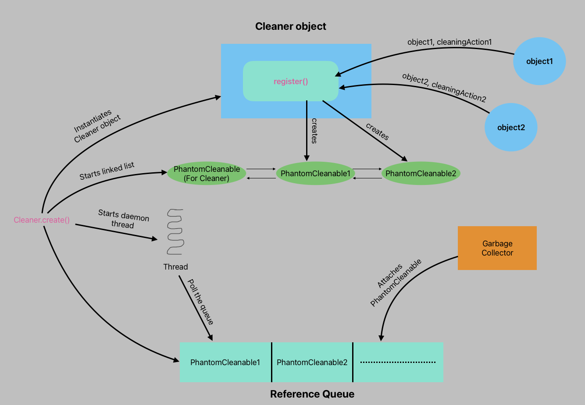

= Java Cleaners: The Modern Way to Manage External Resources
Ahmed Ali Rashid
0.01, Aug 08, 2024: Java Cleaners
:toc:
:icons: font

If you're the type of programmer who likes to  understand the internals of how things work before seeing examples,
you can jump directly to <<_behind_the_scene>> after the introduction. +
Code for this article can be found here on https://github.com/ahmedjaad/understanding-java-cleaners.git[GitHub]

== Introduction

Think of a scenario where you have an object that holds references to external resources (files, sockets, and so on).
And you want
to have control over how these resources are released once the holding object is no longer active/accessible,
how do you achieve that in Java?.
Prior to Java 9 programmers could use a finalizer by overriding the ``*_Object_*``'s class `*_finalize()_*` method.
Finalizers have many disadvantages, including being slow, unreliable and dangerous.
It is one of those features that are hated by both those who implement the JDK and those who use it.

Since Java 9, Finalizers have been deprecated and programmers have a better option to achieve this in Cleaners,
Cleaners provide a better way to manage and handle cleaning/finalizing actions.
Cleaners work in a pattern
where they let resource holding objects register themselves and their corresponding cleaning actions.
And then Cleaners will call the cleaning actions once these objects are not accessible by the application code.

This is not the article to tell you why Cleaners are better than Finalizers, though I will briefly list some of their differences.

.Finalizers Vs Cleaners
|===
|Finalizers |Cleaners

|Finalizers are invoked by one of Garbage Collector’s threads,
you as a programmer don’t have control over what thread will invoke your finalizing logic
|Unlike with finalizers, with Cleaners, programmers can opt to have control over the thread that invokes the cleaning logic.

|Finalizing logic is invoked when the object is actually being collected by GC
|Cleaning logic is invoked when the object becomes *_Phantom Reachable_*, that is our application has no means to access it anymore

|Finalizing logic is part of the object holding the resources
|Cleaning logic and it state are encapsulated in a separate object.

|No registration/deregistration mechanism
|Provides means for registering cleaning actions and explicit invocation/deregistration
|===

== Simple Cleaner in action

Enough chit-chats let us see Cleaners in action.

[source,java]
.ResourceHolder
----
import java.lang.ref.Cleaner;

public class ResourceHolder {
    private static final Cleaner CLEANER = Cleaner.create();
    public ResourceHolder() {
        CLEANER.register(this, () -> System.out.println("I'm doing some clean up"));
    }
    public static void main(String... args) {
        ResourceHolder resourceHolder = new ResourceHolder();
        resourceHolder = null;
        System.gc();
    }
}
----

Few lines of code but a lot is happening here, Let us break it down

. The constant `CLEANER` is of type `*_java.lang.ref.Cleaner_*`, as you can tell from its name,
this is the central and starting point of the Cleaners feature in Java.
The `CLEANER` variable is declared as static as it should be, Cleaners should never be instance variables,
they should be shared across different classes as much as possible.

. In the constructor, instances of `ResourceHolder` are registering themselves to the Cleaner along with their cleaning action, the cleaning action is a *_Runnable_* job that the Cleaner guarantees to invoke at most once (at most once, meaning it is possible not to run at all).
By calling Cleaner's `register()` method, these instances are basically saying two things to the Cleaner
* Keep track of me as long as I live
* And once I am no longer active (*_Phantom Reachable_*), please do your best and invoke my cleaning action.
. In the main method we instantiate an object of `ResourceHolder` and immediately set its variable to null, since the object has only one variable reference, our application can no longer access the object, i.e., it has become *_Phantom Reachable_*
. We call `System.gc()` to request JVM to run the Garbage Collector,
consequentially this will trigger the Cleaner to run the cleaning action.
Typically, you don't need to call `System.gc()` but as simple as our application,
we need to facilitate the Cleaner to run the action

Run the application, and hopefully you see the `I'm doing some clean up` somewhere in your standard output.

CAUTION: We started with the simplest possible way to use Cleaners, so we can demonstrate its usage in a simplified way, bear in mind though this is neither effective nor the right way to use Cleaners

== Cleaners, the right way

Our first example was more than good enough to see Cleaners in action,
but as we warned, it is not the right way to use Cleaners in a real application.
Let's see what is wrong with what we did.

. We initiated a `Cleaner` object as a class member of the `ResourceHolder`: As we mentioned earlier Cleaners should be shared across Classes and should not belong to individual classes, reason behind being each Cleaner instance maintains a thread, which is a limited native resource, and you want to be cautious when you consume native resources. +
In a real application, we typically get a Cleaner object from a utility or a Singleton class like
+
[source,java]
----
private static CLEANER = AppUtil.getCleaner();
----
. We passed in a lambda as our Cleaning action: You should *NEVER* pass in a lambda as your cleaning action.
To understand why,
let us refactor our previous example by extracting the printed out message and make it an instance variable
+
[source,java]
.ResourceHolder
----
public class ResourceHolder {
    private static final Cleaner CLEANER = Cleaner.create();
    private final String cleaningMessage = "I'm doing some clean up";
    public ResourceHolder() {
        CLEANER.register(this, () -> System.out.println(cleaningMessage));
    }
}
----
+
Run the application and see what happens.
I will tell you what happens,
the cleaning action will never get invoked no matter how many times you run your application.
Let us see why

+
--

** Internally, Cleaners make use of `PhantomReference` and `ReferenceQueue` to keep track of registered objects,
once an object becomes *_Phantom Reachable_* the `ReferenceQueue`  will notify the Cleaner
and the Cleaner will use its thread to run the corresponding cleaning action.
** By having
the lambda accessing the instance member
we're forcing the lambda to hold the `this` reference(of `ResourceHolder` instance),
because of this the object will never ever become *_Phantom Reachable_*
because our Application code still has reference to it.

+

NOTE: If you still wonder how in our first example, the cleaning action is invoked despite having it as a lambda.
The reason is, the lambda in the first example does not access any instance variable,
and unlike inner classes, Lambdas won't implicitly hold the containing object reference unless they're forced to.
--
+
The right way is to encapsulate your cleaning action together with the state it needs in a static nested class.
+
WARNING: Don't use inner class anonymous or not,
it is worse than to use lambda
because an inner class instance would hold a reference to the outer class instance regardless of whether they access their instance variable or not

. We didn't make use of the return value from the `Cleaner.create()`:
The `create()` actually returns something very important.
a `Cleanable` object, this object has a `clean()` method that wraps your cleaning logic,
you as a programmer can opt to do the cleanup yourself by invoking the `clean()` method.
As mentioned earlier,
another thing that makes Cleaners superior to Finalizers is that you can actually deregister your cleaning action.
The `clean()` method actually deregisters your object first,
and then it invokes your cleaning action, this way it guarantees the at-most once behavior.

Now let us improve each one of these points and revise our `ResourceHolder` class

[source,java]
.ResourceHolder
----
import java.lang.ref.Cleaner;

public class ResourceHolder {

    private final Cleaner.Cleanable cleanable;
    private final ExternalResource externalResource;

    public ResourceHolder(ExternalResource externalResource) {
        cleanable = AppUtil.getCleaner().register(this, new CleaningAction(externalResource));
        this.externalResource = externalResource;
    }

//    You can call this method whenever is the right time to release resource
    public void releaseResource() {
        cleanable.clean();
    }

    public void doSomethingWithResource() {
        System.out.printf("Do something cool with the important resource: %s \n", this.externalResource);
    }

    static class CleaningAction implements Runnable {
        private ExternalResource externalResource;

        CleaningAction(ExternalResource externalResource) {
            this.externalResource = externalResource;
        }

        @Override
        public void run() {
//          Cleaning up the important resources
            System.out.println("Doing some cleaning logic here, releasing up very important resource");
            externalResource = null;
        }
    }

    public static void main(String... args) {
        ResourceHolder resourceHolder = new ResourceHolder(new ExternalResource());
        resourceHolder.doSomethingWithResource();
/*
        After doing some important work, we can explicitly release
        resources/invoke the cleaning action
*/
        resourceHolder.releaseResource();
//      What if we explicitly invoke the cleaning action twice?
        resourceHolder.releaseResource();
    }
}

----

`ExternalResource` is our hypothetical resource that we want to release when we're done with it.
The cleaning action is now encapsulated in its own class,
and we make use of the `CleaniangAction` object,
we call it's `clean()` method in the `releaseResources()` method to do the cleanup ourselves. +
As stated earlier, Cleaners guarantee at most one invocation of the cleaning action, and since we call the `clean()` method explicitly the Cleaner will not invoke our cleaning action except in the case of a failure like an exception is thrown before the clean method is called, in this case the Cleaner will invoke our cleaning action when the `ResourceHolder` object becomes *_Phantom Reachable_*, that is we use the Cleaner as our *_safety-net_*, our backup plan when the first plan to clean our own mess doesn't work. +

IMPORTANT: The behavior of Cleaners during `System.exit` is implementation specific.
With this in mind,
programmers should always prefer to explicitly invoke the cleaning action over relying on the Cleaners themselves.

== Cleaners, the effective way

By now we've established the right way to use Cleaners is
to explicitly call the cleaning action and rely on them as our backup plan.
What if there's a better way?
Where we don't explicitly call the cleaning action, and the Cleaner stays intact as our safety-net. +
This can be achieved
by having the `ResourceHolder` class implement the `AutoCloseable` interface
and place the cleaning action call in the `close()` method,
our `ResourceHolder` can now be used in a *_try-with-resources_* block.
The revised  `ResourceHolder` should look like below.

[source,java]
.ResourceHolder
----
import java.lang.ref.Cleaner.Cleanable;

public class ResourceHolder implements AutoCloseable {

    private final ExternalResource externalResource;

    private final Cleaner.Cleanable cleanable;

    public ResourceHolder(ExternalResource externalResource) {
        this.externalResource = externalResource;
        cleanable = AppUtil.getCleaner().register(this, new CleaningAction(externalResource));
    }

    public void doSomethingWithResource() {
        System.out.printf("Do something cool with the important resource: %s \n", this.externalResource);
    }
    @Override
    public void close() {
        System.out.println("cleaning action invoked by the close method");
        cleanable.clean();
    }

    static class CleaningAction implements Runnable {
        private ExternalResource externalResource;

        CleaningAction(ExternalResource externalResource) {
            this.externalResource = externalResource;
        }

        @Override
        public void run() {
//            cleaning up the important resources
            System.out.println("Doing some cleaning logic here, releasing up very important resources");
            externalResource = null;
        }
    }

    public static void main(String[] args) {
//      This is an effective way to use cleaners with instances that hold crucial resources
        try (ResourceHolder cleaningExample = new ResourceHolder(new ExternalResource(1))) {
            cleaningExample.doSomethingWithResource();
            System.out.println("Goodbye");
        }
/*
    In case the client code does not use the try-with-resource as expected,
    the Cleaner will act as the safety-net
*/
        ResourceHolder cleaningExample = new ResourceHolder(new ExternalResource(2));
        cleaningExample.doSomethingWithResource();
        cleaningExample = null;
        System.gc(); // to facilitate the running of the cleaning action
    }
}

----

[#_behind_the_scene]
== Cleaners behind the scene

To Understand behind the scene of Cleaners first, we need to get a clear picture of a few,
already mentioned terms, *_phantom-reachable_*, `PhantomReference` and  `RefrenceQueue`

* Consider the following code
+
[source,java]
----
Object myObject = new Object();
----
+
In the Garbage Collector(GC) world the created instance of `Object`  is said to be *_strongly-reachable_*, why?
Because it is alive,
and in-use i.e., Our application code has a reference to it that is stored in the `myObject` variable,
assume we don't set another variable and somewhere in our code this happens
+
[source,java]
----
myObject = null;
----
+
The instance is now said to be *_unreachable_*, and is eligible for reclamation by the GC.
Now let us tweak the code a bit
+
[source,java]
----
Object myObject = new Object();
PhantomReference<Object> reference = new PhantomReference<>(myObject, null);
----
+
`Refrence` is a class provided by JDK to represent reachability of an object during JVM runtime, the object a `Reference` object is referring to is known as `referent`, `PhantomReference` is a type(also an implementation) of `Reference` whose purpose will be explained below in conjunction with `ReferenceQueue` +
Ignore the second parameter of the constructor for now, and again assume somewhere in our code this happens again
+
[source,java]
----
myObject = null;
----
+
Now our object is not just *_unreachable_* it is *_phantom-reachable_*
because no part of our application code can access it, and it is a `referent` of a `PhantomReference` object
* After the GC has finalized a *_phantom-reachable_* object,
the GC attaches its `PhantomReference` object(not the `referent`) to a special kind of queue called `ReferenceQueue`. +
Let us see how these two concepts work together
+
[source,java]
----
Object myObject = new Object();
ReferenceQueue<Object> queue = new ReferenceQueue<>();
PhantomReference<Object> reference1 = new PhantomReference<>(myObject, queue);
myObject = null;
PhantomReference<Object> reference2 = (PhantomReference)queue.remove()
----
+
We supply a `ReferenceQueue`
when we create a `PhantomReachable` so the GC knows where to attach it when its referent has been finalized.
The `ReferenceQueue` class provides two methods to poll the queue,
`remove()`, this will block when the queue is empty until the queue has an element to return,
and `poll()` this is non-blocking, when the queue is empty it will return `null` immediately. +
With that explanation the code above should be easy to understand, once
`myObject` becomes *_phantom-reachable_* the GC will attach the `PhantomReference` object to
`queue` and we get it by using the `remove()` method,
that is to say `reference1` and `reference2` variables refer to the same object.

Now that these concepts are clear, Let's explain two Cleaner-specific types

. For each cleaning action, Cleaner will wrap it in a `Cleanable` instance, `Cleanable` has one method, `clean()`, this method ensure the at-most once invocation behavior before invoking the cleaning action.
. `PhantomCleanable` implements `Cleanable` and extends `PhantomReference`, this class is the Cleaner's way to associate the referent(resource holder) with their cleaning action

From this point on, understanding the internals of Cleaner should be straight forward.

.Cleaner Overview

Let us look at the life-cycle of a `Cleaner` object

* The static `Cleaner.create()` method instantiates a new `Cleaner` but it also does a few other things
+
--
** It instantiates a new `ReferenceQueue`, that the `Cleaner` objet's thread will be polling
** It creates a doubly linked list of `PhantomCleanable` objects,
these objects are associated with the queue created from the previous step.
** It creates a `PhantomCleanable` object with itself as the referent and empty cleaning action.
** It starts a daemon thread that will be polling the `ReferenceQueue` as long as the doubly linked list is not empty.
--
+
By adding itself into the list,
the cleaner ensures that its thread runs at least until the cleaner itself becomes unreachable
* For each `Cleaner.register()` call, the cleaner creates an instance of `PhantomCleanable` with the resource holder as the referent and the cleaning action will be wrapped in the `clean()` method, the object is then added to the aforementioned linked list.
* The Cleaner's thread will be polling the queue, and when a `PhantomCleanable` is returned by the queue, it will invoke its `clean()` method. +
Remember the `clean()` method only calls the cleaning action if it manages to remove the `PhantomCleanable` object from the linked list, if the `PhantomCleanable` object is not on the linked list it does nothing
* The thread will continue to run as long as the linked list is not empty, this will only happen when
** All the cleaning actions have been invoked, and
** The Cleaner itself has become *_phantom-reachable_* and has been reclaimed by the GC

NOTE: To understand more and see how Cleaners work,
checkout the `OurCleaner`  class under the `cleaner` package that imitates the JDK real implementation of `Cleaner`.
You can replace the real `Cleaner` and `Cleanable` with `OurCleaner` and `OurCleanable` respectively in all of our examples
and play with it.